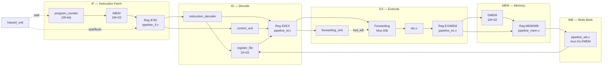

# EduRISC-32 — Arquitetura RTL

## Visão Geral

O **EduRISC-32** é um processador educacional de 32 bits implementado em Verilog-2012,
com pipeline de 5 estágios, detecção de hazards e forwarding completo.
É a evolução natural do simulador Python EduRISC-16, mantendo compatibilidade de ISA.

| Propriedade | Valor |
|---|---|
| Largura de palavra | 32 bits |
| Banco de registradores | 16 × 32 bits (R0–R15) |
| R15 | Link Register (CALL / RET) |
| PC | 28 bits (espaço de 256 M palavras) |
| Profundidade IMEM/DMEM | 1 M palavras × 32 bits cada |
| Estágios do pipeline | 5 (IF / ID / EX / MEM / WB) |
| Forwarding | EX/MEM → EX; MEM/WB → EX |
| Detecção de hazard | Load-use (stall 1 ciclo); Branch (flush 1 ciclo) |

---

## ISA — Formatos de Instrução

```
Tipo-R:  [ 31:28 opcode ][ 27:24 rd ][ 23:20 rs1 ][ 19:16 rs2 ][ 15:0 não-usado ]
Tipo-I:  [ 31:28 opcode ][ 27:24 rd ][ 23:20 rs1 ][ 19:0  imm20 sinalizado      ]
Tipo-J:  [ 31:28 opcode ][ 27:0  addr28                                          ]
Tipo-M:  [ 31:28 opcode ][ 27:24 rd ][ 23:20 base ][ 19:0  offset20 sinalizado  ]
```

### Tabela de Opcodes

| Opcode | Mnemônico | Tipo | Operação |
|--------|-----------|------|----------|
| 0x0 | ADD  | R/I | rd = rs1 + rs2 \| imm20 |
| 0x1 | SUB  | R   | rd = rs1 − rs2 |
| 0x2 | MUL  | R   | rd = rs1 × rs2 |
| 0x3 | DIV  | R   | rd = rs1 ÷ rs2 |
| 0x4 | AND  | R   | rd = rs1 & rs2 |
| 0x5 | OR   | R   | rd = rs1 \| rs2 |
| 0x6 | XOR  | R   | rd = rs1 ^ rs2 |
| 0x7 | NOT  | R   | rd = ~rs1 |
| 0x8 | LOAD | M   | rd = Mem[base + offset20] |
| 0x9 | STORE| M   | Mem[base + offset20] = rd |
| 0xA | JMP  | J   | PC = addr28 |
| 0xB | JZ   | J   | if Z: PC = addr28 |
| 0xC | JNZ  | J   | if !Z: PC = addr28 |
| 0xD | CALL | J   | R15 = PC+1; PC = addr28 |
| 0xE | RET  | R   | PC = R15 |
| 0xF | HLT  | —   | Para o pipeline |

---

## Diagrama de Blocos do Pipeline



---

## Estrutura de Arquivos RTL

```
rtl_v/
├── isa_pkg.vh            Constantes e defines da ISA
├── alu.v                 ALU completa (12 operações, 4 flags)
├── register_file.v       Banco 16×32 bits, dual-read, single-write
├── program_counter.v     PC 28-bit com stall/load
├── instruction_decoder.v Extração de campos da instrução (combinacional)
├── control_unit.v        Geração de sinais de controle por opcode
├── hazard_unit.v         Detecção de load-use e branch hazards
├── forwarding_unit.v     Forwarding EX/MEM→EX e MEM/WB→EX
├── pipeline_if.v         Registrador de pipeline IF/ID
├── pipeline_id.v         Registrador de pipeline ID/EX
├── pipeline_ex.v         Registrador de pipeline EX/MEM
├── pipeline_mem.v        Registrador de pipeline MEM/WB
├── pipeline_wb.v         Mux de write-back (combinacional)
├── memory_interface.v    IMEM + DMEM (block RAM)
└── cpu_top.v             Top-level — instancia e conecta tudo
```

---

## Temporização do Pipeline

```
Ciclo:  1     2     3     4     5     6     7     8
ADD      IF    ID    EX    MEM   WB
SUB            IF    ID    EX¹   MEM   WB
MUL                  IF    ID    EX    MEM   WB

¹ O forwarding de EX/MEM envia o resultado do ADD direto para o
  operando A do SUB no ciclo 4 — sem stall.
```

### Load-Use Hazard (stall de 1 ciclo)

```
Ciclo:  1     2     3     4     5     6     7     8
LOAD     IF    ID    EX    MEM   WB
ADD            IF    ID  [NOP]  EX    MEM   WB
                            ↑ stall inserido pela hazard_unit
```

### Branch Hazard (flush de 1 ciclo)

```
Ciclo:  1     2     3     4     5     6
JNZ      IF    ID    EX    MEM   WB
?inst          IF  [NOP]                ← flush: instrução descartada
target               IF    ID    EX    ...
```

---

## Simulação com Icarus Verilog

### Pré-requisitos

- [Icarus Verilog ≥ 11](https://bleyer.org/icarus/) (Windows: instalador `.exe`)
- [GTKWave](https://gtkwave.sourceforge.net/) (opcional, para visualização de waveforms)

### Compilar e simular (testbench completo)

```bash
# A partir da raiz do projeto
iverilog -g2012 -I rtl_v -o sim.out testbench/cpu_tb.v rtl_v/alu.v rtl_v/register_file.v \
  rtl_v/program_counter.v rtl_v/instruction_decoder.v rtl_v/control_unit.v \
  rtl_v/hazard_unit.v rtl_v/forwarding_unit.v rtl_v/pipeline_if.v rtl_v/pipeline_id.v \
  rtl_v/pipeline_ex.v rtl_v/pipeline_mem.v rtl_v/pipeline_wb.v \
  rtl_v/memory_interface.v rtl_v/cpu_top.v

vvp sim.out
gtkwave testbench/dump.vcd &   # opcional
```

### Via main.py (recomendado)

```bash
# Verificar sintaxe RTL
python main.py rtl-build

# Simular com programa próprio
python main.py rtl-sim meu_prog.hex

# Comparar Python vs RTL
python main.py compare meu_prog.hex

# Simular com waves
python main.py rtl-sim meu_prog.hex --waves
```

---

## Síntese FPGA (Xilinx Arty A7-35T)

### Passos no Vivado

1. Criar projeto Verilog, adicionar todos os arquivos de `rtl_v/` como fontes de design.
2. Adicionar `fpga/top_module.v` como top-level e `fpga/constraints.xdc` como constraint.
3. Editar `fpga/top_module.v` — linha `parameter IMEM_HEX = "prog.hex"` deve apontar para
   o arquivo hex do seu programa.
4. **Run Synthesis → Run Implementation → Generate Bitstream**
5. Programar via JTAG: `Hardware Manager → Open Target → Program Device`

### Mapeamento de I/O (Arty A7-35T)

| Sinal | Pino | Função |
|-------|------|--------|
| `sys_clk` | E3 | Clock 100 MHz |
| `sys_rst` | D9 | BTN0 — reset ativo alto |
| `led[0..3]` | H5/J5/T9/T10 | LD0–LD3: R0[3:0] após halt |

### Frequência máxima estimada

Com a CPU em 100 MHz (sem divisor de clock), o timing closure depende do critical path
da ALU + forwarding mux. Em prática, frequências de 80–120 MHz são típicas para uma
implementação não-otimizada no Artix-7 35T.

---

## Forwarding — Detalhes

```
    ID/EX         EX/MEM        MEM/WB
   ┌──────┐      ┌──────┐      ┌──────┐
   │ rs1  │      │  rd  │      │  rd  │
   │ rs2  │      │ alu  │      │ data │
   └──────┘      └──┬───┘      └──┬───┘
        ↓   fwd_a   ↓              ↓
   ┌─── MUX ◄─────────────────────┘
   │    (00=RF, 10=EX/MEM, 01=MEM/WB)
   └──► ALU operando A
```

A `forwarding_unit` implementa hierarquia: EX/MEM tem prioridade sobre MEM/WB
(instrução mais recente prevalece).

---

## Hazard Detection — Detalhes

```verilog
// Load-use hazard
load_use = ex_mem_read && ((ex_rd == id_rs1) || (ex_rd == id_rs2));

// Ações quando load_use == 1:
//   PC:    stall (não incrementa)
//   IF/ID: stall (mantém instrução atual)
//   ID/EX: flush (injeta NOP — zera todos os controles)
```

---

## Integração Python ↔ RTL

O `main.py` provê três comandos de integração RTL:

| Comando | Descrição |
|---------|-----------|
| `python main.py rtl-build` | Verifica sintaxe com iverilog (sem executar) |
| `python main.py rtl-sim <hex>` | Executa testbench RTL via iverilog+vvp |
| `python main.py compare <hex>` | Compara registradores Python vs RTL lado a lado |

O fluxo completo de uma instrução `C → assembly → hex → comparação`:

```bash
python main.py build     programa.c  -o prog.hex
python main.py compare   prog.hex
```

---

## Testes do Testbench

O arquivo `testbench/cpu_tb.v` executa 7 testes automatizados:

| Teste | Cobertura | Resultado esperado |
|-------|----------|--------------------|
| TEST 1 | ADD/SUB/AND/OR/XOR/NOT com imediatos | R3=17, R4=3, R5=2, R6=15, R7=13 |
| TEST 2 | MUL / DIV | R3=42, R4=6 |
| TEST 3 | LOAD / STORE | R2=R3=0xDEADBEEF |
| TEST 4 | Loop JNZ (Σ 1..5) | **R1=15** (mesmo do Demo 1 Python) |
| TEST 5 | Forwarding EX/MEM→EX | R1=1, R2=2, R3=3 |
| TEST 6 | Load-use hazard | R2=99, R3=198 |
| TEST 7 | CALL / RET | R1=20, R2=40 |
